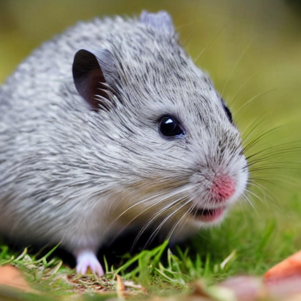
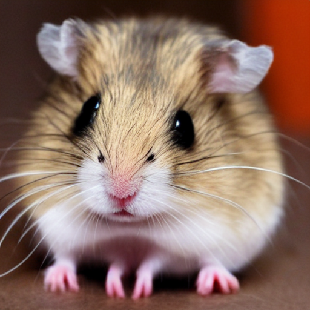
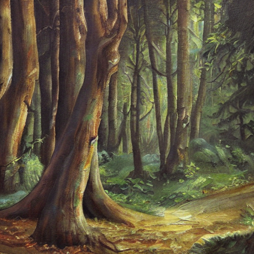
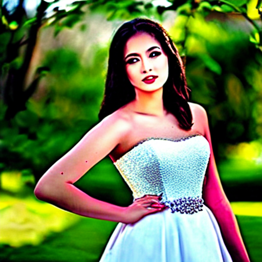
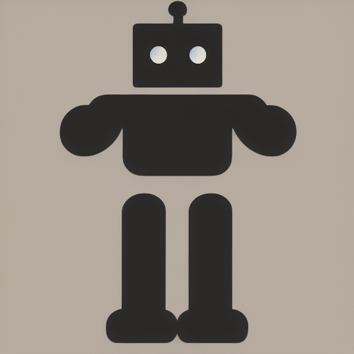
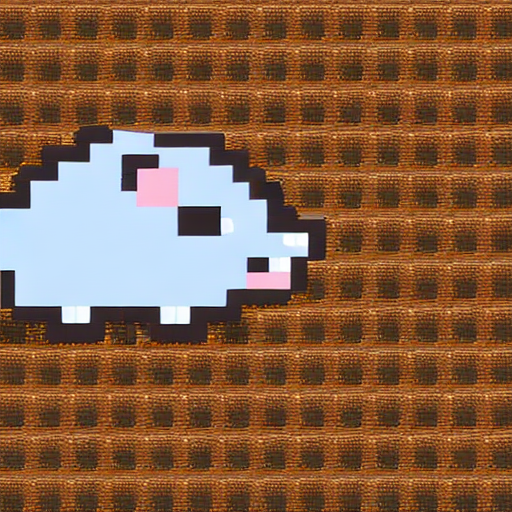
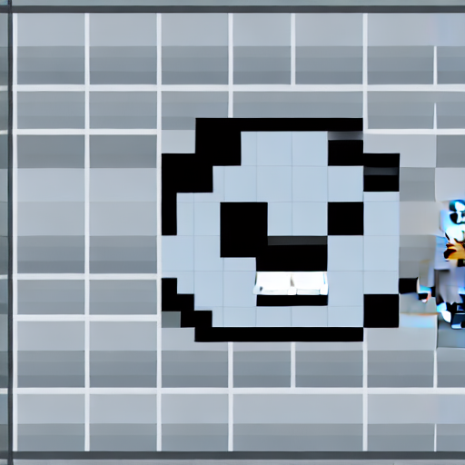

# 🎨 프롬프트 엔지니어링 워크숍 포트폴리오

> Stable Diffusion AI를 활용한 이미지 생성 실습 결과물

## 👤 수강생 정보

| 항목 | 내용 |
|------|------|
| **이름** | 송다은 |
| **학번** | 10317 |
| **작성일** | 2026년 01월 23일 |
| **총 작품 수** | 11개 |

---

## 📚 회차별 학습 기록

### 📖 1회차: 첫 AI 이미지 생성

**학습 기법**: 기본 프롬프팅

#### 작품 1

| 항목 | 내용 |
|------|------|
| **프롬프트** | `a gray hamster` |
| **네거티브** | `-` |
| **생성 시간** | 2026-01-23 06:48:01 |

> 질문을 구체적이게 할 수록 그림을 그릴때 지켜야 할 것이 많아져서 퀄리티가 높아짐

---

### 📖 2회차: Zero-shot vs Detail

**학습 기법**: 상세 프롬프팅

#### 작품 1

| 항목 | 내용 |
|------|------|
| **프롬프트** | `a hamster` |
| **네거티브** | `-` |
| **생성 시간** | 2026-01-23 06:49:21 |

> 제로슛은 구체적인 예시나 설명없이 단순히 요청하는 것이고 디테일은 구체적인 예시나 설명을 들어 요청하는 것이다

---

### 📖 3회차: Persona & Style

**학습 기법**: 스타일 프롬프팅

#### 작품 1

| 항목 | 내용 |
|------|------|
| **프롬프트** | `a forest, oil painting style, rich textures, classical art` |
| **네거티브** | `-` |
| **생성 시간** | 2026-01-23 06:51:02 |

> 하나의 큰 요소로 어떤 말이나 설명을 덧붙이냐에 따라 결과가 많이 달라짐

---

### 📖 4회차: Negative Prompting

**학습 기법**: 네거티브 프롬프팅

#### 작품 1

| 항목 | 내용 |
|------|------|
| **프롬프트** | `a beautiful portrait of a young woman, elegant dress, garden background, soft lighting` |
| **네거티브** | `bad hands, extra fingers, mutated hands, poorly drawn face, mutation, deformed, ugly` |
| **생성 시간** | 2026-01-23 06:20:37 |

> 창의적이게 하였을때는 색감이나 화질 정도가 이쁘지만, 사람의 얼굴같은 것들은 보기 좀 기괴하다. 반대로 프롬포트를 지킬려고 했을 때는 색감이나 화질은 별로지만, 사람의 얼굴이나 몸은 퀄리티가 좋게 나온다.

#### 작품 2

| 항목 | 내용 |
|------|------|
| **프롬프트** | `a beautiful portrait of a young woman, elegant dress, garden background, soft lighting` |
| **네거티브** | `bad hands, extra fingers, mutated hands, poorly drawn face, mutation, deformed, ugly` |
| **생성 시간** | 2026-01-23 06:53:10 |

> 창의적이게 하였을때는 색감이나 화질 정도가 이쁘지만, 사람의 얼굴같은 것들은 보기 좀 기괴하다. 반대로 프롬포트를 지킬려고 하였을 때는 색감이나 화질은 별로지만, 사람의 얼굴이나 몸은 퀄리티가 좋게 나온다.

---

### 📖 5회차: Step-back Prompting

**학습 기법**: 추상화 프롬프팅

#### 작품 1

| 항목 | 내용 |
|------|------|
| **프롬프트** | `alone` |
| **네거티브** | `blurry, low quality, distorted, text, watermark` |
| **생성 시간** | 2026-01-23 06:30:03 |

> step-back를 쓰지 않는다면 Ai가 생각하는 것을 출력해서 우리 기준에서는 이해할 수 없는 그런 그림이 생성되는 것 같다

#### 작품 2

| 항목 | 내용 |
|------|------|
| **프롬프트** | `a person sitting alone on an empty bench, rainy day, view from behind, grey cloudy sky, melancholic atmosphere` |
| **네거티브** | `blurry, low quality, distorted, text, watermark` |
| **생성 시간** | 2026-01-23 06:54:19 |

> step-back를 쓰지 않는다면 Ai가 생각하는 것을 출력해서 우리 기준에서는 이해할 수 없는 그런 그림이 생성되는 것 같다

---

### 📖 6회차: Chain of Thought

**학습 기법**: 레이어 빌딩

#### 작품 1

| 항목 | 내용 |
|------|------|
| **프롬프트** | `a robot` |
| **네거티브** | `blurry, low quality` |
| **생성 시간** | 2026-01-23 06:35:28 |

> cot를 활용하면 Ai가 결과를 더 구체적이게 하고, 퀄리티가 더 올라간다

#### 작품 2

| 항목 | 내용 |
|------|------|
| **프롬프트** | `a robot` |
| **네거티브** | `blurry, low quality` |
| **생성 시간** | 2026-01-23 06:55:47 |

> cot를 활용하면 Ai가 더 구체적이고, 더 좋은 퀄리티의 결과를 내는 것 같다

---

### 📖 7회차: 종합 실습

**학습 기법**: 종합

#### 작품 1

| 항목 | 내용 |
|------|------|
| **프롬프트** | `a cute gray hamster, pixel art, 16-bit, retro game style, highly detailed, sharp focus, 8k resolution` |
| **네거티브** | `blurry, low quality, distorted, ugly, bad anatomy` |
| **생성 시간** | 2026-01-23 06:42:56 |

> 이미지 하나를 만들 때도 여러가지 요소를 조절할 수 있다는 것이 흥미롭다

#### 작품 2

| 항목 | 내용 |
|------|------|
| **프롬프트** | `a gray hamster, pixel art, 16-bit, retro game style, highly detailed, sharp focus, 8k resolution` |
| **네거티브** | `blurry, low quality, distorted, ugly, bad anatomy` |
| **생성 시간** | 2026-01-23 06:58:13 |

> 어떻게 설명하고 어떻게 요청하는지에 따라 결과가 많이 바뀌고,  어떤 것을 얼마나 제한하거나 풀어주나에 따라 결과가 많이 바뀌는 것이 흥미롭다

---

## 🏆 Best 작품

**선택한 작품**: 

**선택 이유**: 

---

## 💡 워크숍 후기

---

## 🛠️ 사용 기술

- Stable Diffusion
- Streamlit
- Google Colab + ngrok

---

<i>🎓 KNU 프롬프트 엔지니어링 워크숍 수료</i>

